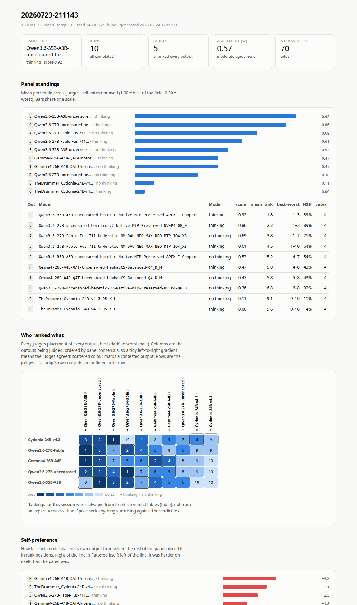

# Roundtable

Local LLMs sitting around a table: every model answers the same prompt, they
judge each other's answers blind, and the panel's own top pick writes the final
word — three rounds, one HTML report of who won, who disagreed, and how much of
the result is just models flattering themselves.

No dependencies. No build step. `roundtable report <session>` writes one
self-contained `report.html` you can open with `file://`; `roundtable up` runs
the whole thing — form, worker, live report — as one local app.



## The three rounds

1. **Generation.** Every model answers the identical prompt. (`roundtable`
   shells out to `creative-bench.sh` for the actual GPU work — see below.)
2. **Blind judging.** Every model reads all the answers, anonymised, and ranks
   them. See "Why it exists" for why the anonymising is load-bearing, not
   cosmetic.
3. **Synthesis.** Roundtable computes the consensus itself — mean percentile,
   agreement, where judges split — and hands that *table*, not raw judge prose,
   to whichever model the panel rated highest. That model writes the final
   summary. It is reporting the numbers, not re-opening the judging: see
   `digest.py`.

Round 3 is optional and needs Round 2 to have actually produced a scored panel
(blind judging, at least one usable ranking) — skipped otherwise, not
fabricated.

## Why blind judging is load-bearing

Benchmarking creative writing has no unit test. The usual fix is to let the models
judge each other — but that only works if you take two things away from them:

**1. Names.** In an early session, one model produced *byte-identical* text in two
runs, and every judge still ranked the copy labelled "no thinking" lower — one of
them by eight places. They were grading the label, not the prose. So outputs are
shown to judges as anonymous tags (`{{A}}`, `{{B}}`…), shuffled, with speed and
mode stripped out. A session judged with names visible is rendered but never
scored, and the report says why.

**2. Their own vote.** Models are not neutral about their own work — in both
directions. Self-votes are excluded from every score, head-to-head and percentile
on the page, and reported separately as a self-preference chart, because the size
and *sign* of that bias turns out to be one of the more interesting numbers in the
run.

**3. Who is on the panel.** By default the judges *are* the field — everyone who
competed also votes. That is fine until the field is a family: four variants of
one base model and one outsider is four relatives grading their own. **Re-judge**
on any session queues Round 2 again over the same outputs with a panel you pick,
which may be models that never competed. Nothing is generated a second time, so
it costs one model load per judge and answers the only question that matters
about a suspicious result: does it survive a different jury? On the command line
that is `--summarize-only DIR --judges "a,b"`.

The previous panel's verdicts move into `.judges-N/` inside the session first,
so two panels are never pooled into one set of standings. They are kept, not
deleted — the old scores, the old de-anonymised verdicts and any Round 3
synthesis built on them all move together.

## What's in a report

| Section | Round | Question it answers |
|---|---|---|
| Synthesis | 3 | The panel's top pick reporting the computed consensus in prose |
| Panel standings | 2 | Who won, by mean percentile across judges (self-votes removed) |
| Who ranked what | 2 | A judge × output rank heatmap — where the panel agreed and where it split |
| Agreement (Kendall's W) | 2 | Is this a consensus or a coin flip? Tie-corrected |
| Self-preference | 2 | How far each model placed its own output from where the panel placed it |
| Speed against quality | 1+2 | Panel score against tok/s — what the extra time bought you |
| Runs | 1 | Raw numbers per generation |
| Judges | 2 | How each verdict's ranking was read |

Every chart has a table beside it, works in light and dark, and carries no
JavaScript — the whole page is CSS and hand-generated SVG.

## Usage

```sh
roundtable report SESSION                # -> SESSION/report.html
roundtable report --all ~/bench-results  # every session under a root
roundtable report SESSION --no-prompts   # leave your prompts out, for sharing

roundtable chain SPEC.json                # run a multi-prompt chain, stage by stage

roundtable submit job.json               # queue a bench run
roundtable work                          # run queued jobs, one at a time
roundtable work --drain                  # ...then stop when the queue empties
roundtable status                        # queue depth + what the worker is doing
roundtable cancel JOB                    # stop a queued or running job
roundtable clean                         # clear jobs a dead worker left claimed
```

`--running` is how live progress works without a server: the report is rewritten
after every run and carries `<meta http-equiv="refresh">`, so the browser polls by
simply reloading. The final write drops the tag — when the page stops reloading,
the session is done. Every write is atomic, so a reload can never catch a
half-written file.

The worker rebuilds **on each new result file**, not on a clock, so the page fills
in as runs land. A fallback timer covers the gaps and retunes itself after every
run — about three rebuilds per run, clamped to 5–60 s. A 20-second run polls
briskly; a five-minute one doesn't rewrite the page thirty times for nothing.
The first run has nothing to learn from yet, so it starts at 10 s.

## Chains: several prompts in sequence

A chain runs a series of prompts, one panel round each, where each stage's
winners feed the next stage's prompt as `{{PREVIOUS}}`. It's for pipelines like
"analyze a manuscript → build an edit plan → execute the edit → QC it → judge
it publication-ready" — see `examples/manuscript-edit-chain.json` for that one
worked end to end.

```sh
roundtable chain SPEC.json               # -> a timestamped dir, one combined report.html
roundtable chain SPEC.json --root DIR    # write there instead
```

Two settings are kept separate at every handoff, on purpose:

- **`models`** — the roster: who generates *this* stage's answers. Omit it on
  a `use_previous: own` stage (below) — the roster there comes from whoever
  survived the prior stage, not a fresh list.
- **`use_previous`** — the selection: how much of the *prior* stage's field
  gets shown to this stage's roster as `{{PREVIOUS}}`:
  - `all` / `top3` / `top1` — ranked by that stage's own blind judging, and
    shared: every model on the roster reads the *same* merged, relettered
    `{{PREVIOUS}}` text (still anonymised, same reasoning as blind judging —
    a model that recognises another model's prose defers to it rather than
    reading it). Ten models with `top3` is ten generations conditioned on the
    same three survivors, not thirty.
  - `own` — each model that survived the prior stage continues with *only its
    own* prior output, as its own single-model generation; the results are
    merged back into one directory and judged together at the end of the
    stage. This is the one place a chain runs more than one prompt in a
    stage, and it's still not branching in the sense the rest of the chain
    avoids: nothing fans out past the roster size, and everything
    reconverges into one ranking every stage.

  When a stage can't be ranked (a lone model, or `"blind": false`), `all` /
  `top3` / `top1` quietly fall back to every successful output rather than
  inventing an order.

`{{MANUSCRIPT}}` is a second placeholder, filled from the spec's top-level
`"manuscript"` (a file path) or `"manuscript_text"` (inline text — `"manuscript_text"`
wins if both are given) in every stage that uses it, for source text that
should stay available across the whole chain, not just the immediately
preceding stage. The Multi-Prompt tab's Manuscript box is a paste-in textarea
and always sends `"manuscript_text"`.

A stage can also opt into `"meta_summary": true` — the same Round 3 synthesis
a plain session gets (`digest.py`): once that stage has a scored panel, its
own top-ranked model writes a short synthesis explaining the verdict. Useful
on the last stage, so a chain ends with prose, not just a ranked table.

Each generate+judge stage is written under `<root>/<NN>-<name>/`, holding an
ordinary session directory with its own `report.html` (an `own` stage's
merged directory sits one level deeper, under a timestamp, since several
single-model runs land there). Live progress within a stage is the same as a
plain session's: `report.html` rebuilds as each result lands, self-refreshing
until the stage finishes — chains reuse the exact same polling loop
(`worker.run_and_poll`), so a stage in flight looks and behaves like a normal
running job. `should_stop`/cancelling reaches a stage already in progress the
same way, killing its subprocess rather than waiting for it to finish.
`<root>/chain.json` records the roster and selection at every handoff,
updated after every stage rather than only at the end; `<root>/report.html`
is the chain's own report -- every stage rendered with the exact same
sections a plain session's report gets (tiles, standings, verdicts, the
Round 3 synthesis if a stage asked for one), one stack after another in run
order, so a chain reads as more rounds of the same report rather than a
different kind of page. It self-refreshes while the chain is still running,
same as a plain session's does.

### The Multi-Prompt tab

`roundtable serve` / `roundtable up` has a **Multi-Prompt** tab alongside
Results, New run and Queue — fields and checkboxes, not JSON. The model
roster is picked once, at the top of the form (the same checklist as the New
run tab, plus a manuscript textarea to paste a story into) — not per stage.
Below that, one card per stage holds its own system prompt and prompt
textarea, a "start from a template" dropdown that fills a stage from the
manuscript-editing workflow this tab shipped with (editable afterwards —
overwrite any field to write your own instead), and a checkbox for a final
synthesis. "+ Add stage" clones a blank card; "Remove this stage" drops one.

The first stage runs the chosen roster; every stage after that automatically
has each of those models continue *its own* previous answer (`use_previous:
"own"` — see above). That's deliberately the only wiring the tab offers today
— per-stage rosters, or a shared top-3/top-1 handoff between stages, are real
things to want and the chain engine already supports them (see the JSON
fields above), just not from this form yet. Reach for `roundtable chain
SPEC.json` with a hand-written spec — or edit one, like
`examples/manuscript-edit-chain.json` — for those combinations in the
meantime.

Queuing a chain runs it through the same worker and queue as everything else,
so it never runs at the same time as a single-prompt job (still one model in
VRAM at a time). Cancelling a chain from the Queue tab takes effect between
stages, not mid-stage — a stage already running always finishes or fails on
its own first.

A chain spec is still plain JSON underneath (see above) — the CLI
(`roundtable chain SPEC.json`) and `examples/manuscript-edit-chain.json` use
that form directly, and it's what the tab's fields get assembled into on
submit.

## The queue

```
$ROUNDTABLE_SPOOL/          (default ~/.local/state/roundtable)
    queue/     jobs waiting, oldest first
    running/   the one job a worker has claimed
    done/      finished, with the session directory and exit code recorded
    failed/    what went wrong, kept for reading
    logs/      runner output, one file per job
    worker.json  heartbeat: which worker, doing what, since when
    cancel.json  a standing request to stop one job, if any
```

No lock, no database, no daemon protocol. A worker claims a job by **renaming**
it out of `queue/` — rename is atomic within a filesystem, so if two workers ever
race, exactly one wins. Submitting writes a dot-file and renames it in, so a
scan can never pick up a half-written job. Nothing is lost if the machine dies
mid-run: the job file is still sitting in `running/`.

A single worker consuming the queue serially *is* the "one model in VRAM at a
time" constraint — expressed as architecture rather than as a mutex someone has
to remember to take.

### Stopping a run, and runs that stopped themselves

Cancel is a file too: the UI (and `roundtable cancel`) writes `cancel.json`, the
worker notices within a second, kills the runner's whole process group — model
included — and files the job as failed. Whatever finished is kept, and the
session's report is rewritten as a finished one.

Nothing is lost when the machine dies mid-run, but nothing *notices* either: the
claim sits in `running/` and reads as in flight forever. So a worker reaps on
startup and whenever it goes idle — any claim no live worker owns is failed, and
its half-written report settled. The index shows those as **stopped** with a
button to clear them, and `roundtable clean` does the same from a shell. Reaped
jobs are failed rather than requeued: a rerun would start a second session from
scratch while the first is still on disk, so that call belongs to you.

A job is plain JSON:

```json
{
  "system_prompt": "You are a careful editor.",
  "user_prompt": "Rewrite the opening with more tension.",
  "temperature": 1.0,
  "mode": "thinking",
  "models": ["Qwen3.6-27B:thinking", "Gemma4-26B:nothinking"],
  "summarize": true,
  "meta_summary": true,
  "blind": true
}
```

`models` entries are substring patterns matched against the runner's model
paths, each optionally carrying its own mode as `pattern:thinking` /
`:nothinking` / `:both` — the form's per-model checkboxes send exactly this.
A bare pattern with no suffix falls back to the top-level `mode`. `summarize`
is Round 2 (blind judging); `meta_summary` is Round 3 and needs
`summarize: true` to have anything to synthesise — the worker skips it,
rather than fabricating a summary, if Round 2 didn't produce a scored panel.
The worker turns the job into flags for the bench script — it reimplements no
benchmarking logic of its own; Round 3 is one more call to the same script,
`--meta-summary <dir> --meta-model <slug>`, appending a `round3_*.md` into the
existing session rather than starting a new one.

### Running it as a service

```sh
cp packaging/roundtable-worker.service ~/.config/systemd/user/
systemctl --user daemon-reload
systemctl --user enable --now roundtable-worker
```

Then queue five configurations, close the browser, and come back to five
finished reports. The web page never drives a run — it's a window onto a file the
worker keeps rewriting.

## The bench runner

The actual model-loading and GPU work is a separate bash script,
`bin/creative-bench.sh` — bundled in this repo, so a fresh clone works out of
the box. It's the only piece here that isn't pure Python: it drives
`llama-server` directly (load a model, send one prompt, save the result, unload,
repeat), and Roundtable's worker only ever shells out to it with flags. No
benchmarking logic is duplicated in Python.

It needs two things:

```sh
LLAMA_BIN="$HOME/Apps/llama.cpp-src/build/bin/llama-server"   # a built llama-server
LM_MODELS="$HOME/.lmstudio/models"                            # a directory of *.gguf files
```

`llama-server` is found automatically if it's on your `PATH`; otherwise set
`LLAMA_BIN` to point at it. Set `LM_MODELS` if your `*.gguf` files live somewhere
other than the LM Studio default. Override either as an environment variable. Run
`bin/creative-bench.sh --help` for the rest of its flags and knobs — Roundtable
uses `--system`, `--user`, `--models "pattern:mode,..."`, `--meta-summary`, and
a handful of others, all documented there.

If you already maintain your own copy elsewhere, point `ROUNDTABLE_RUNNER` at
it and Roundtable uses that instead of the bundled one.

## Reading a session directory

Roundtable reads what `creative-bench.sh` leaves on disk:

```
20260723-211143/
    system-prompt.txt  user-prompt.txt   Round 1's prompt (never overwritten by Round 3)
    01_<stamp>_<model>_thinking.md       Round 1: one per run, frontmatter + output
    SUMMARIZE.md                         what the Round 2 judges were shown
    SUMMARIZE-KEY.md                     tag -> model (absent = not blind)
    summary_<stamp>_<model>.md           Round 2: one per judge
    round3_<stamp>_<model>.md            Round 3: the panel's top pick's synthesis
    .judges-1/                           a superseded panel, moved aside by a re-judge
```

Rankings are read from each verdict by three readers, most reliable first:

1. **`RANKING: {{A}} > {{B}} > {{C}}`** — an explicit final line. Exact.
2. A markdown rank table — handles bold cells, `9/10` shared ranks, and two
   outputs in one row. Best-effort.
3. An ordered list. Best-effort.

The report always states which reader was used, so a regex guess is never
presented as data. If a verdict is pure prose with no table, Roundtable reports
nothing for it rather than inventing a ranking.

## Status

Working — 135 tests, `python3 -m unittest discover -s tests`:

- `roundtable report`, and the rank/consensus extraction behind it
- `roundtable submit` / `work` / `status`, the file queue, and live report
  rebuilds during a run
- `roundtable serve` / `up` — the submit form (with the built-in role presets,
  see `presets/`) and a one-command app: form + worker together
- Saving, editing, deleting, and resetting your own presets from the form
  itself — no hand-editing `~/.config/roundtable/presets.json` required.
  Saving under an existing preset's name edits it in place (matched by id,
  not by title text, since a bundled preset's id doesn't always match its
  title — e.g. `red-team` for "Red Team / Devil's Advocate"). Deleting an
  edited *bundled* preset reverts to the shipped original rather than
  removing it outright; "Reset to factory presets" does that for everything
  at once by discarding the user file entirely.
- Round 3 (`digest.py`): computing the consensus table, picking the panel's top
  entry, and running it as one more call to the bench script

The worker suite runs against `tests/stub_runner.sh`, a stand-in that writes a
session directory with the same shape as the real thing (all three rounds) in
about a second — so the queue, the worker and the live rebuild are all testable
without loading a model onto a GPU.

Planned:

- **Resume.** A worker stopped mid-run marks the job failed and keeps whatever
  runs finished; it does not restart where it left off. Real resume needs the
  bench runner to skip runs whose result files already exist *and* to reuse the
  original session seed — a resumed session that re-rolls its seed is no longer
  a fair comparison.

One worker consuming a queue serially *is* the "one model in VRAM at a time"
constraint expressed as architecture — no lock manager, no streaming, no session
state. The whole pipeline is debuggable with `ls`.

## License

MIT
